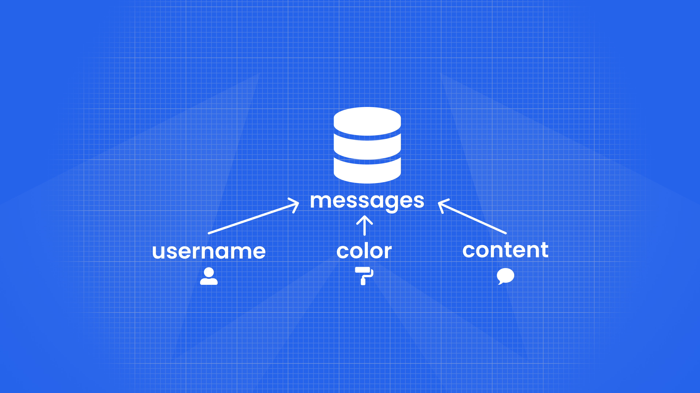

# Collanvas — Your whole team, changing the world one stroke at a time 🎨

With an online whiteboard, you can **brainstorm** 🧠, **draw art** 🖌️, and even **play games** 🕹️ with your teammates and your friends. <mark>No login</mark> is required, and each user has access to the **chatroom**, a real-time messaging platform to have all kinds of discussions. Choose your own username, pick your own color palette, and go draw the next big thing! 🚀

## Overview video

## How it works

### How the data is stored:

| Data      | Description                        | Type                           |
| --------- | ---------------------------------- | ------------------------------ |
| Color     | The color of the stroke            | **String** (HEX)               |
| Thickness | The thickness of the stroke        | **Number** (1 to 10)           |
| Type      | Whether stroke is pen or eraser    | **String** ('Pen' or 'Eraser') |
| Points    | The points that make up the stroke | **{x: Number,y: Number}[]**    |

Keys are generates like `canvas:{roomKey}`. For each generated key, data is stored by running the [`ARRAPPEND`](https://redis.io/commands/json.arrappend/) command like: `JSON.ARRAPPEND canvas:{roomKey} {...data}`.

| Data     | Description                                           | Type             |
| -------- | ----------------------------------------------------- | ---------------- |
| Content  | Content of the sent message                           | **String**       |
| Username | Name of the user that sent the message                | **String**       |
| Color    | Unique color chosen by the user that sent the message | **String** (HEX) |

Keys are generates like `messages:{roomKey}`. For each generated key, data is stored by running the [`ARRAPPEND`](https://redis.io/commands/json.arrappend/) command like: `JSON.ARRAPPEND messages:{roomKey} {...data}`.

### How the data is accessed:

When the user enters a new room, a PUT request is sent to the server with the room key.

- **If the room exists,**
  - We return the existing data to the user by running [`JSON.GET`](https://redis.io/commands/json.get/) on the `messages` and `canvas` JSON documents.
- **Otherwise,**
  - We instantiate a new room by creating those two JSON documents with the command [`JSON.SET`](https://redis.io/commands/json.set/) and fill them with two empty arrays, respectively.

For real-time funcionality, [Redis Pub/Sub](https://redis.io/docs/manual/pubsub/) is used to transmit data between existing users without running [`JSON.GET`](https://redis.io/commands/json.get/) every time that happens.

## How to run it locally?

### Prerequisites

- Node - v12.19.0
- NPM - v6.14.8

### Local installation

Get started by [installing Redis](https://redis.io/docs/getting-started/installation/) on your machine.

Next, go to the project's root directory and run the following commands in order:

- `npm install` or `yarn`
- `npm run dev` or `yarn dev`

Open your browser and navigate to `localhost:3000`. You're running a local version of Redis, so you won't have access to the [production database](https://collanvas.herokuapp.com/).

## Deployment

To make deploys work, you need to create free account on [Redis Cloud](https://redis.info/try-free-dev-to)

### Heroku

### Vercel

Collanvas is using WebSockets, which are unforunately unsupported by Vercel's Serverless Functions.

## More Information about Redis Stack

Here some resources to help you quickly get started using Redis Stack. If you still have questions, feel free to ask them in the [Redis Discord](https://discord.gg/redis) or on [Twitter](https://twitter.com/redisinc).

### Getting Started

1. Sign up for a [free Redis Cloud account using this link](https://redis.info/try-free-dev-to) and use the [Redis Stack database in the cloud](https://developer.redis.com/create/rediscloud).
1. Based on the language/framework you want to use, you will find the following client libraries:
   - [Redis OM .NET (C#)](https://github.com/redis/redis-om-dotnet)
     - Watch this [getting started video](https://www.youtube.com/watch?v=ZHPXKrJCYNA)
     - Follow this [getting started guide](https://redis.io/docs/stack/get-started/tutorials/stack-dotnet/)
   - [Redis OM Node (JS)](https://github.com/redis/redis-om-node)
     - Watch this [getting started video](https://www.youtube.com/watch?v=KUfufrwpBkM)
     - Follow this [getting started guide](https://redis.io/docs/stack/get-started/tutorials/stack-node/)
   - [Redis OM Python](https://github.com/redis/redis-om-python)
     - Watch this [getting started video](https://www.youtube.com/watch?v=PPT1FElAS84)
     - Follow this [getting started guide](https://redis.io/docs/stack/get-started/tutorials/stack-python/)
   - [Redis OM Spring (Java)](https://github.com/redis/redis-om-spring)
     - Watch this [getting started video](https://www.youtube.com/watch?v=YhQX8pHy3hk)
     - Follow this [getting started guide](https://redis.io/docs/stack/get-started/tutorials/stack-spring/)

The above videos and guides should be enough to get you started in your desired language/framework. From there you can expand and develop your app. Use the resources below to help guide you further:

1. [Developer Hub](https://redis.info/devhub) - The main developer page for Redis, where you can find information on building using Redis with sample projects, guides, and tutorials.
1. [Redis Stack getting started page](https://redis.io/docs/stack/) - Lists a
